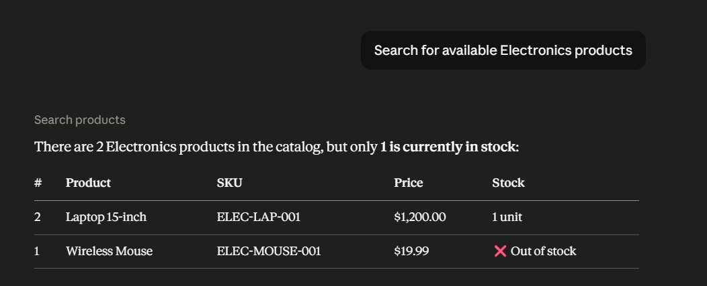
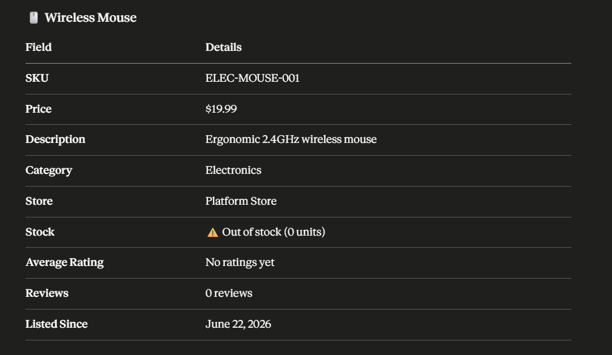
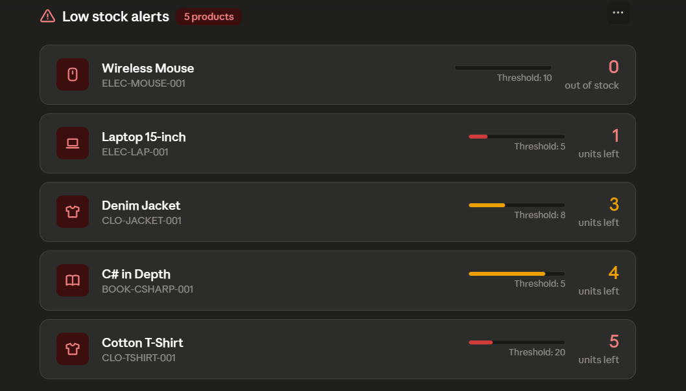
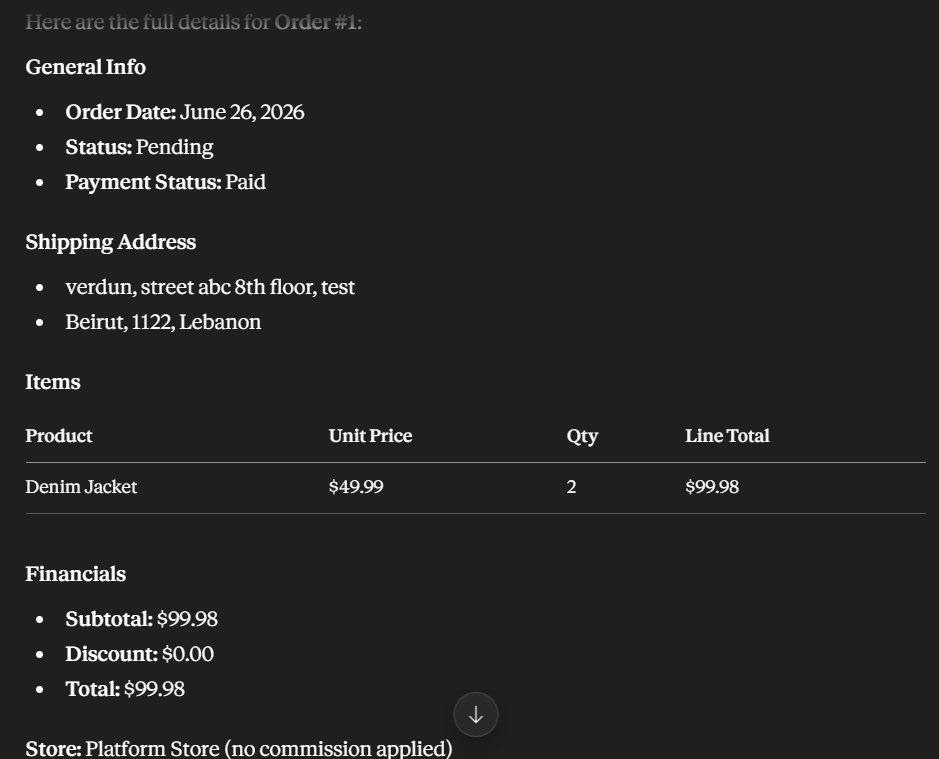
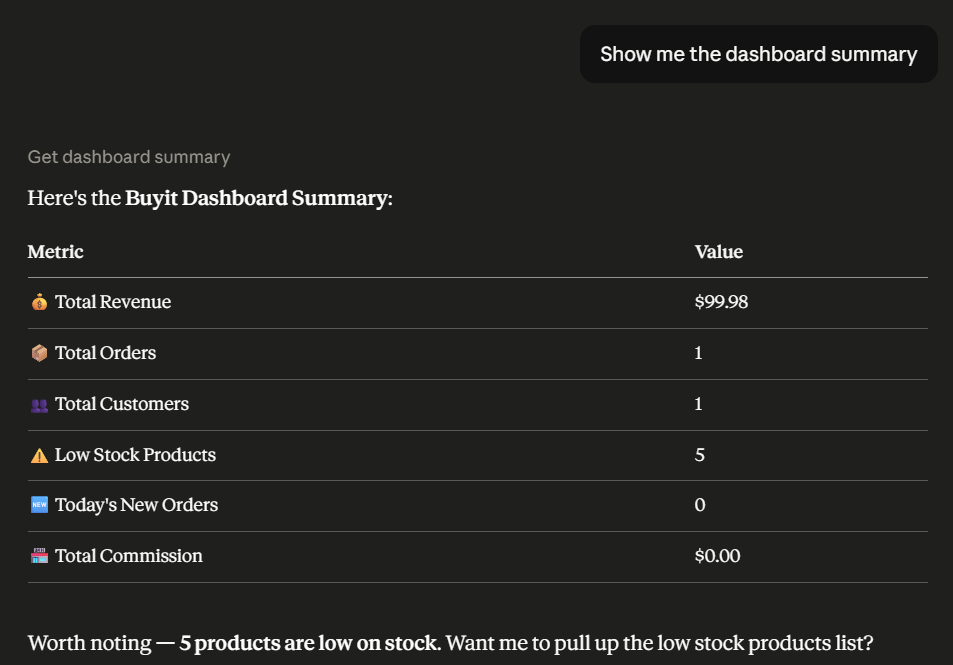
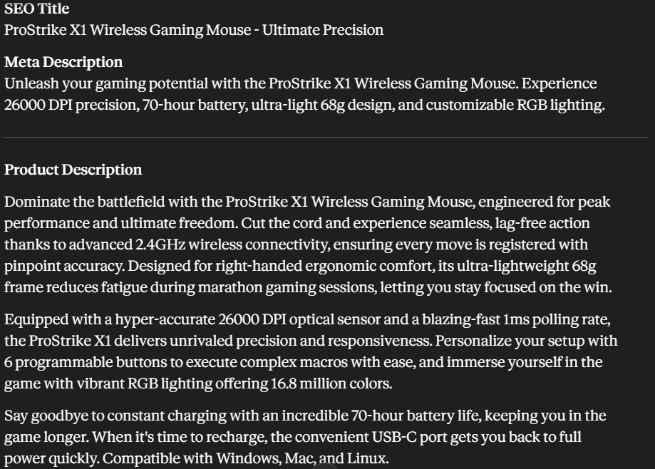

# Buyit MCP — Claude Desktop Tool Demo

**Date:** June 26, 2026  
**Tested by:** Khodor  
**MCP Project:** `Buyit.MCP`  
**Transport:** Stdio (Claude Desktop)  
**Model:** Claude Sonnet (claude-ai 0.1.0)

---

## Setup

The `Buyit.MCP` console application is registered in Claude Desktop via `claude_desktop_config.json`:

```json
{
  "mcpServers": {
    "buyit": {
      "args": [
        "run",
        "--project",
        "C:\\Aspire Internship\\Buyit\\Buyit.MCP\\Buyit.MCP.csproj",
        "--no-build"
      ],
      "command": "dotnet"
    }
  }
}
```

The MCP server connects directly to the PostgreSQL database via Entity Framework Core, using the same service layer as the REST API. No HTTP calls are made — tools resolve services through DI and query the database directly.

---

## Tools Tested

### 1. `search_products`

**Prompt:** `Search for available Electronics products`

**Result:** ✅ Success

Claude called `search_products` with `categoryId` filtered to Electronics and returned a structured table of matching products with stock status.

> "There are 2 Electronics products in the catalog, but only **1 is currently in stock**"

| # | Product | SKU | Price | Stock |
|---|---------|-----|-------|-------|
| 2 | Laptop 15-inch | ELEC-LAP-001 | $1,200.00 | 1 unit |
| 1 | Wireless Mouse | ELEC-MOUSE-001 | $19.99 | ❌ Out of stock |



---

### 2. `get_product`

**Prompt:** `Get me details for product ID 1`

**Result:** ✅ Success

Claude called `get_product` with `productId=1` and returned full product details.

| Field | Details |
|-------|---------|
| Name | Wireless Mouse |
| SKU | ELEC-MOUSE-001 |
| Price | $19.99 |
| Description | Ergonomic 2.4GHz wireless mouse |
| Category | Electronics |
| Store | Platform Store |
| Stock | ⚠️ Out of stock (0 units) |
| Average Rating | No ratings yet |
| Reviews | 0 reviews |
| Listed Since | June 22, 2026 |



---

### 3. `get_low_stock_products`

**Prompt:** `Show me all low stock products`

**Result:** ✅ Success

Claude called `get_low_stock_products` and returned all 5 products currently at or below their restock threshold, ordered by quantity ascending.

| Product | SKU | Stock | Threshold | Status |
|---------|-----|-------|-----------|--------|
| Wireless Mouse | ELEC-MOUSE-001 | 0 | 10 | Out of stock |
| Laptop 15-inch | ELEC-LAP-001 | 1 | 5 | Critical |
| Denim Jacket | CLO-JACKET-001 | 3 | 8 | Low |
| C# in Depth | BOOK-CSHARP-001 | 4 | 5 | Low |
| Cotton T-Shirt | CLO-TSHIRT-001 | 5 | 20 | Low |



---

### 4. `get_order`

**Prompt:** `Get me the details for order ID 1`

**Result:** ✅ Success

Claude called `get_order` with `orderId=1` and `isAdmin=true` and returned full order details.

**General Info**
- Order Date: June 26, 2026
- Status: Pending
- Payment Status: Paid

**Shipping Address**
- verdun, street abc 8th floor, test
- Beirut, 1122, Lebanon

**Items**

| Product | Unit Price | Qty | Line Total |
|---------|-----------|-----|------------|
| Denim Jacket | $49.99 | 2 | $99.98 |

**Financials**
- Subtotal: $99.98
- Discount: $0.00
- Total: $99.98
- Store: Platform Store (no commission applied)



---

### 5. `get_customer_orders`

**Prompt:** `Get all orders for customer ID 1`

**Result:** ✅ Success

Claude called `get_customer_orders` with `userId=1` and returned the paginated order history for the customer. 1 order found matching the order placed on June 26, 2026 for $99.98 (Status: Pending, Payment: Paid).


---

### 6. `get_dashboard_summary`

**Prompt:** `Show me the dashboard summary`

**Result:** ✅ Success

Claude called `get_dashboard_summary` and returned a live snapshot of platform metrics.

| Metric | Value |
|--------|-------|
| 💰 Total Revenue | $99.98 |
| 📦 Total Orders | 1 |
| 👥 Total Customers | 1 |
| ⚠️ Low Stock Products | 5 |
| 🆕 Today's New Orders | 0 |
| 💸 Total Commission | $0.00 |



---

### 7. `generate_product_content`

**Prompt:** `Generate product content for a wireless gaming mouse`

**Result:** ✅ Success

Claude called `generate_product_content` and Gemini returned fully structured marketing content.

**SEO Title:** ProStrike X1 Wireless Gaming Mouse - Ultimate Precision

**Meta Description:** Unleash your gaming potential with the ProStrike X1 Wireless Gaming Mouse. Experience 26000 DPI precision, 70-hour battery, ultra-light 68g design, and customizable RGB lighting.

**Product Description:**

Dominate the battlefield with the ProStrike X1 Wireless Gaming Mouse, engineered for peak performance and ultimate freedom. Cut the cord and experience seamless, lag-free action thanks to advanced 2.4GHz wireless connectivity, ensuring every move is registered with pinpoint accuracy.

Equipped with a hyper-accurate 26000 DPI optical sensor and a blazing-fast 1ms polling rate, the ProStrike X1 delivers unrivaled precision and responsiveness. Personalize your setup with 6 programmable buttons and immerse yourself in the game with vibrant RGB lighting offering 16.8 million colors.

Say goodbye to constant charging with an incredible 70-hour battery life. Compatible with Windows, Mac, and Linux.

**Key Features:**
1. Lag-Free 2.4GHz Wireless Connectivity
2. Hyper-Accurate 26000 DPI Optical Sensor
3. Ultra-Lightweight 68g Ergonomic Design
4. Extended 70-Hour Battery Life
5. Customizable RGB Lighting & 6 Programmable Buttons



---

## Summary

| Tool | Status | Notes |
|------|--------|-------|
| `search_products` | ✅ Pass | Filters by category, returns stock status |
| `get_product` | ✅ Pass | Full product details by ID |
| `get_low_stock_products` | ✅ Pass | Returns all 5 low-stock products ordered by quantity |
| `get_order` | ✅ Pass | Admin mode bypasses user check, returns full order graph |
| `get_customer_orders` | ✅ Pass | Paginated order history by user ID |
| `get_dashboard_summary` | ✅ Pass | Live platform metrics from DB |
| `generate_product_content` | ✅ Pass | Gemini AI generates SEO title, meta description, product copy, and 5 key features |

**All 6 tools fully operational.** ✅
